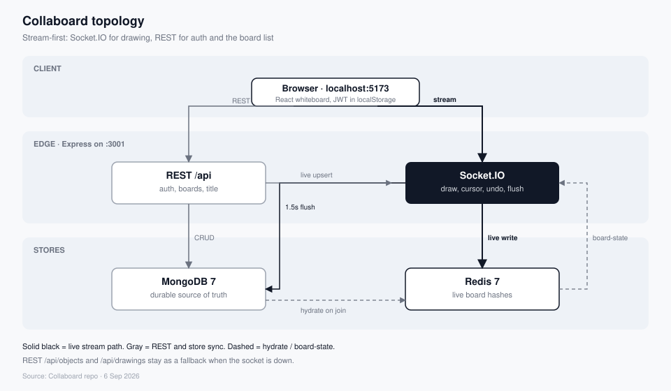

# Architecture topology

Collaboard is stream-first. **Socket.IO** is the live path for drawing. **REST** is the control plane (auth, board list, title). **Redis** holds the in-flight board. **MongoDB** is durable storage.

Solid black arrows are the live stream. Gray arrows are REST and store sync. Dashed arrows are hydrate and `board-state` coming back.

| Node | Layer | Role |
| --- | --- | --- |
| Browser | Client | Vite + React at `:5173`. Auth, dashboard, one open-canvas whiteboard. JWT in `localStorage`. Board opens via `?boardId=`. |
| REST `/api` | Edge | Express JSON on `:3001/api`. Login, register, `/auth/me`, board list, create/delete board, title. Rate limit is off in development. |
| Socket.IO | Edge | Same process, port `3001`. Rooms `board-{id}`. Streams draw, delete, cursor, undo, viewport, flush, and clear. Redis adapter for pub/sub. |
| Redis 7 | Live store | Hashes for objects, drawings, history, users, viewport, and a ready flag. Cursors are ephemeral (socket broadcast). Hydrated from Mongo on first join. |
| MongoDB 7 | Durable store | Users, boards, slide objects, ink strokes, collaborators. Server flushes Redis here after a **commit** (mouseup, insert, delete), and on leave, disconnect, Save, or Clear. |

## What travels where

| Action | Path | Lands in |
| --- | --- | --- |
| Sign in / register / me | REST `/api/auth` | Mongo `users` |
| List / create / delete board | REST `/api/boards` | Mongo `boards` |
| Rename board | REST `PUT /boards/:id` | Mongo `boards` |
| Draw, reshape, erase | Socket.IO | Redis live preview, Mongo on commit |
| Cursor | Socket.IO `cursor-move` | Broadcast only (~20 Hz); clients interpolate |
| Camera | Socket.IO `viewport-update` | Redis viewport, then board doc |
| Save / leave / disconnect | Socket flush | Mongo objects + ink |
| Join empty room | hydrate | Mongo → Redis |

## Redis keys

| Key | Holds |
| --- | --- |
| `board:{id}:objects` | Slide objects |
| `board:{id}:drawings` | Ink strokes |
| `board:{id}:history` | Last 200 undo actions |
| `board:{id}:users` | Presence |
| `board:{id}:viewport` | Last camera |
| `board:{id}:ready` | Hydrated; empty stays empty |

## Mongo collections

| Collection | Holds |
| --- | --- |
| `users` | Accounts |
| `boards` | One slide, background, viewport |
| `slideobjects` | Text, shape, image, table, chart, icon |
| `inkstrokes` | Pen paths |
| `boardcollaborators` | Share permissions |

REST `/api/objects` and `/api/drawings` remain as a fallback when the socket is down.

## Collaboration model

Live edits follow presence + commit, not operational transform.

- **Preview** — while the pointer is down, `drawing-update` patches Redis (`points`, size, or `x,y`) and broadcasts. Mongo is not written on the hot path.
- **Commit** — mouseup, insert, paste, and delete send a compact patch plus `drawing-commit`. The server then flushes Redis to Mongo. Zero-size cancelled shapes are deleted instead of committed.
- **Cursors** — `cursor-move` at ~20 Hz (`CURSOR_INTERVAL_MS = 50`). The server broadcasts only; clients interpolate with lerp so motion looks smooth between packets.
- **Undo** — last 200 **committed** actions. In-progress previews are not history entries.
- **Viewport** — Redis-only until the next commit, leave, disconnect, Save, or Clear.

## Development mode

`npm run dev` from the repo root starts Docker Mongo/Redis, the API, and Vite. Unless `NODE_ENV=production`, the API seeds `slide@example.com` / `devpass123` and the sign-in screen shows **Use demo account**. Rate limiting is off. Vite proxies `/api` and `/socket.io` to `:3001`.

See also [data store setup](./MONGODB_SETUP.md) and [WebSocket implementation](./WEBSOCKET_IMPLEMENTATION.md).
